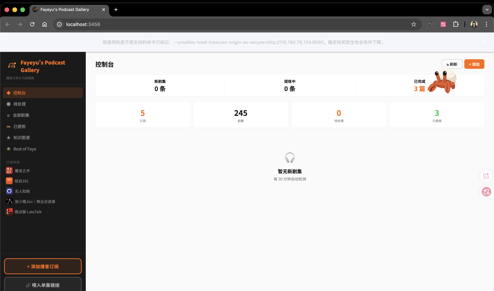
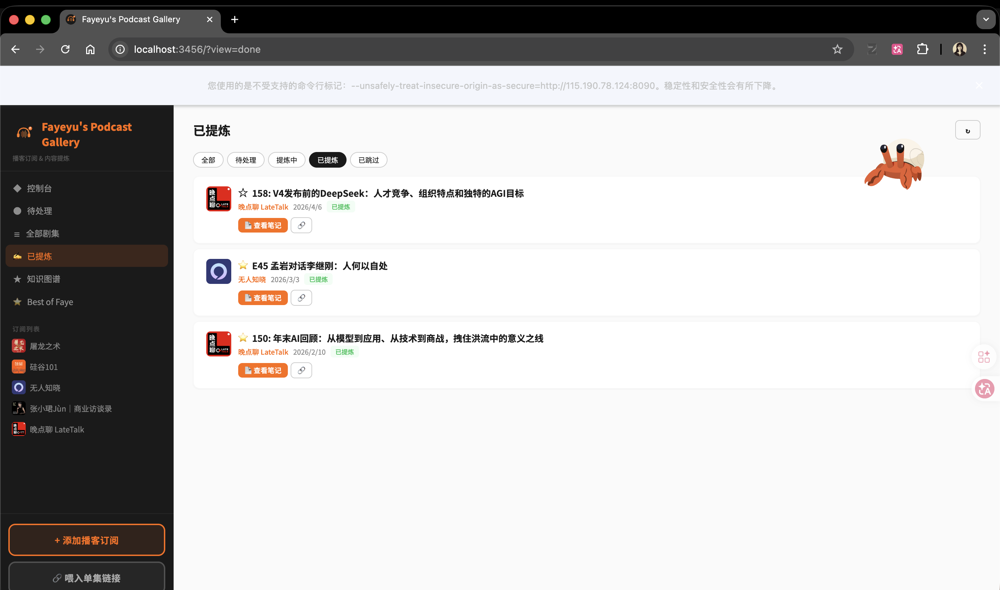
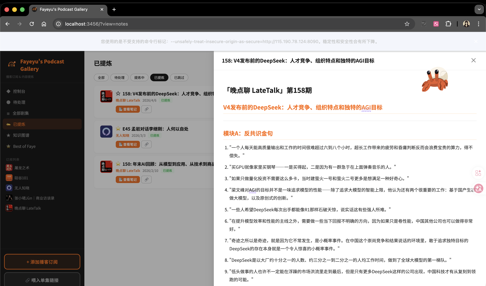
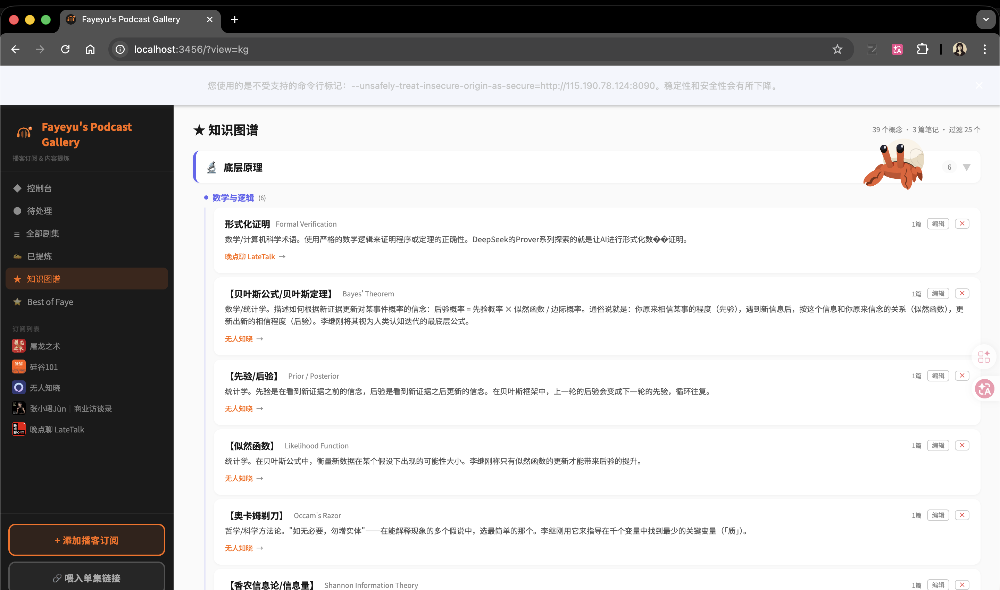
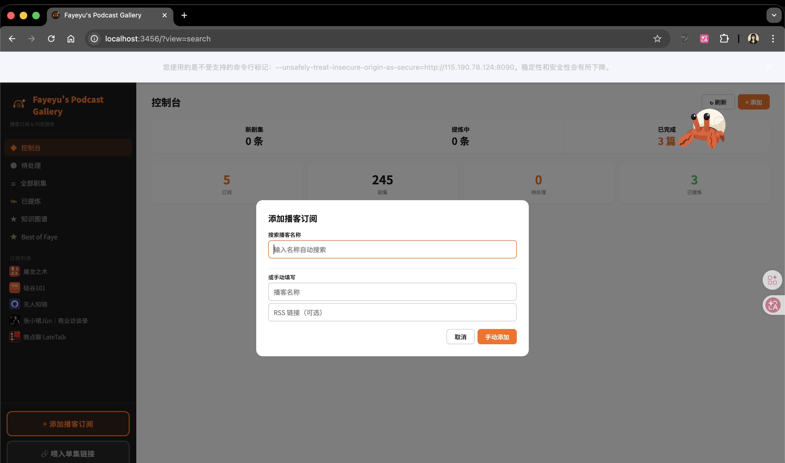

<p align="center">
  
</p>

<h1 align="center">Fayeyu's Podcast Gallery</h1>

<p align="center">
  <strong>播客订阅 &rarr; 全自动转录 &rarr; AI 内容提炼 &rarr; 知识图谱</strong><br>
  一个人的播客学习工作站
</p>

<p align="center">
  
  
  
  
</p>

---

## What is this?

> 你有没有过这种体验：听了一期很好的播客，想记住里面的核心观点，但过几天就忘了？

**Fayeyu's Podcast Gallery** 解决的就是这个问题。它是一个**全自动**的播客知识提炼系统：

- 你只需要**点一个按钮**
- 系统自动完成：下载音频 &rarr; Groq Whisper 极速转录 &rarr; Claude AI 按专业方法论提炼结构化笔记
- 最后生成一张**可交互的知识图谱**，把所有播客中的核心概念串联起来

---

## Screenshots

### 控制台 — 一眼看清所有状态

> 订阅播客数量、新剧集、提炼进度、一目了然

### 全自动提炼 — 点一个按钮搞定一切

> 点击「自动提炼」后系统全自动：下载 &rarr; 转录 &rarr; AI 提炼，进度条实时更新

### 笔记抽屉 — 三模块结构化输出

> 右侧滑出抽屉，Markdown 渲染。每篇笔记包含：**反共识金句** + **分章节核心观点** + **专业名词词典**

### 知识图谱 — 跨播客概念网络

> 所有播客中提到的专业概念，按 6 大领域自动分类。概念可编辑、可移动、可标注。点击概念直接跳转到笔记原文。

### 搜索订阅 — 输入名字自动获取 RSS

> 输入播客名称，自动从 Apple Podcasts 搜索，一键订阅。每 30 分钟自动检测新剧集。

---

## Core Features

### 1. 播客订阅与监测
- 输入名称自动搜索 Apple Podcasts 并获取 RSS
- 每 30 分钟自动检测更新
- 「喂入单集链接」— 非订阅播客也能直接加入

### 2. 全自动提炼流水线
```
点击「自动提炼」
     |
     v
[下载音频] RSS enclosure, 自动重试, 断点续传
     |
     v
[Groq Whisper 转录] 1h 播客 ≈ 2min, 自动分片, 限频重试
     |
     v
[Claude AI 提炼] 按 podcast-notion-notes Skill 输出三模块笔记
     |
     v
[保存 + 进度条实时更新]
```

### 3. 三模块结构化笔记

| 模块 | 内容 | 标准 |
|------|------|------|
| **反共识金句** | 10-20 条与常识相悖但有论证的观点 | 放在最前面作为快速索引 |
| **分章节核心观点** | 按话题分章，含核心命题 + 展开论述 + 话语体系 | 还原完整论述结构，保留原话风格 |
| **专业名词词典** | AI / 经济学 / 哲学等专业术语 | 通俗解释 + 本集语境说明 |

### 4. 知识图谱（Obsidian 风格）
- **6 大领域分类**：底层原理 / AI 基础理论 / AI 工程 / AI 应用 / 商业与战略 / 经济与金融
- **双向链接**：概念 &harr; 笔记原文，点击跳转 + 高亮闪烁
- **术语弹出卡片**：笔记中的专业术语紫色高亮，点击弹出定义 + 跨播客引用
- **可编辑**：删除、重命名、移动分类、添加个人标注
- **智能过滤**：自动排除嘉宾自创概念和产品名，只保留通用知识

### 5. Best of Faye
星标收藏你最喜欢的播客剧集，形成个人精选库。

---

## Tech Stack

| Layer | Technology |
|-------|-----------|
| Frontend | Vanilla JS + marked.js |
| Backend | Node.js + Express + SQLite |
| Transcription | **Groq Whisper API** (cloud, ultra-fast) > mlx-whisper (Apple Silicon) > faster-whisper (CPU) |
| AI Extraction | Claude Code CLI (`claude -p`) |
| RSS | rss-parser + node-cron (30min interval) |
| Process Manager | pm2 |

---

## Quick Start

### Prerequisites
- Node.js 18+, Python 3.10+, ffmpeg
- [Claude Code](https://claude.ai/code) installed & logged in
- [Groq API Key](https://console.groq.com/keys) (free)

### Install & Run
```bash
git clone https://github.com/slgz1115-wjw/fayeyu-podcast-gallery.git
cd fayeyu-podcast-gallery
npm install
pip3 install faster-whisper groq

# Configure
cat > ecosystem.config.js << 'EOF'
module.exports = {
  apps: [{
    name: 'podcast-gallery',
    script: 'server.js',
    env: { GROQ_API_KEY: 'your_key_here' }
  }]
};
EOF

# Start
pm2 start ecosystem.config.js
# Visit http://localhost:3456
```

---

## Project Structure
```
server.js          # Express API, RSS, SQLite
pipeline.js        # Download → Transcribe → Claude extract
transcribe.py      # Multi-engine: Groq > mlx-whisper > faster-whisper
public/index.html  # Frontend SPA
public/logo.svg    # Logo
```

---

<p align="center"><em>Built with Claude Code</em></p>
